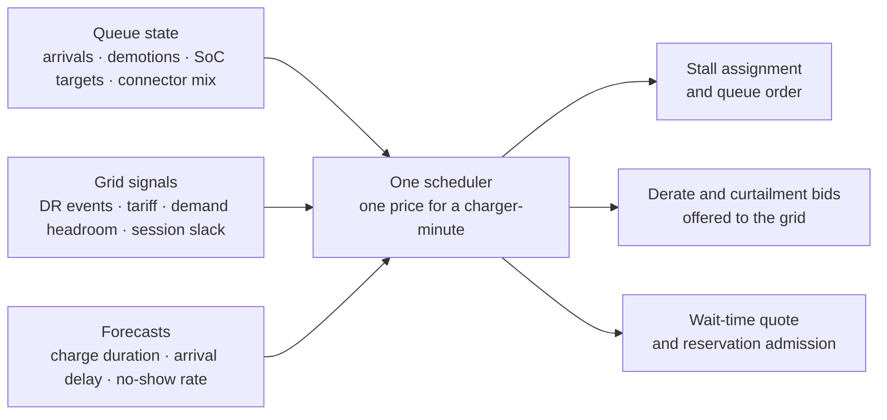
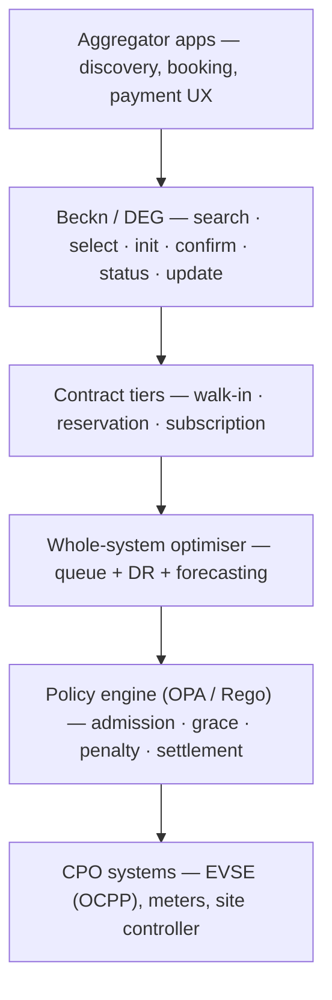
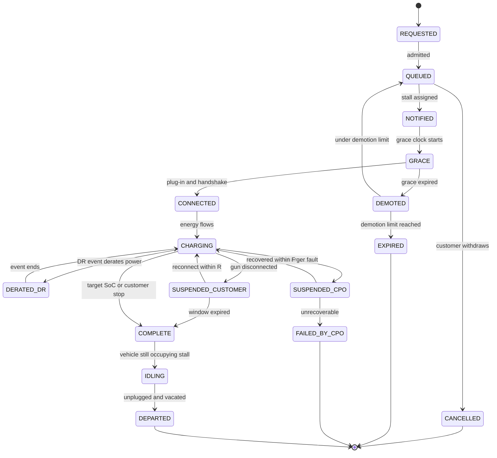
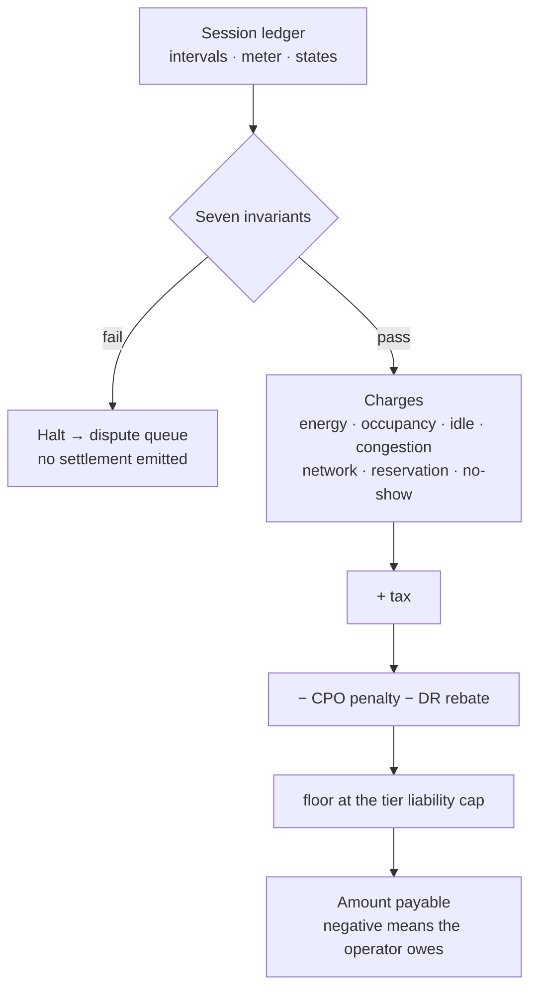
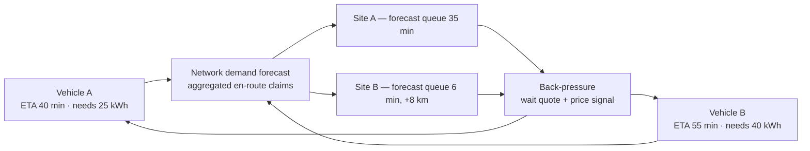

# The Charger-Minute Problem

### A settlement-first architecture for interoperable EV charging

---

## Summary

1. A charging network is largely selling one thing: **charger-minutes at a stall**. Three parties compete for them — the walk-in, the reservation holder, and the grid, which bids for the kilowatts flowing through those minutes rather than for the minutes themselves.
2. A great many complaints about EV charging look like symptoms of allocating those minutes badly: crowding, queue-jumping, phantom availability, missed reservations, and demand-charge surprises.
3. Queue management and demand response are usually built as separate systems, but they look like the same problem: three contract policies pricing independently, and one scheduler — the operator's own, rather than the network's — that needs to see all three at once.
4. Interoperability is what makes this workable across independent operators, though it seems to need the network to standardise the telemetry that makes forecasting possible and the contract that makes penalties enforceable, rather than just discovery and booking.
5. The enforceable core is a settlement over a state-time ledger: every second of a session attributed to one party, every rupee traceable to a state, and the result a pure function of ledger and policy version. That is what most of this note tries to set out.

Figure 1, §12 and §9 carry most of the argument, if you would rather not read it all. The equations and the policy code sit in the appendices, so the main text can be read without them.

Disclaimer1: This note is a perosnal thought-exercise meant to improve the quality of interoperable EV charging networks, and highlighting the role of optimiziers. It may not represent the views of organizations I worked for.

Disclaimer2: After I wrote down the initial idea, the refinements of this note have been AI-assisted. There could be errors, kindly let us know and I shall fix them promptly.
---

## Contents

**The problem**

- [1. A charger is not quite like a pump](#1-a-charger-is-not-quite-like-a-pump)
- [2. The idea this note is built on](#2-the-idea-this-note-is-built-on)
- [3. Where this is being built](#3-where-this-is-being-built)

**The design**

- [4. Architecture at a glance](#4-architecture-at-a-glance)
- [5. The session state machine](#5-the-session-state-machine)
- [6. Contract A — the walk-in](#6-contract-a--the-walk-in)
- [7. Contract B — the reservation](#7-contract-b--the-reservation)
- [8. Failure modes and the mechanism that prevents each](#8-failure-modes-and-the-mechanism-that-prevents-each)

**Why an operator would join**

- [9. Interoperability without commoditisation](#9-interoperability-without-commoditisation)
- [10. What must cross the boundary](#10-what-must-cross-the-boundary)
- [11. Gaming, and why interoperability creates it](#11-gaming-and-why-interoperability-creates-it)

**Enforcement**

- [12. Policy as code, in DEG terms](#12-policy-as-code-in-deg-terms)
- [13. The scheduler is best left to the operator](#13-the-scheduler-is-best-left-to-the-operator)
- [14. Settlement](#14-settlement)
- [15. Worked example](#15-worked-example)

**Beyond a single site**

- [16. Back-pressure and trip planning](#16-back-pressure-and-trip-planning)
- [17. Out of scope](#17-out-of-scope)
- [18. What must be standardised](#18-what-must-be-standardised)

**Appendices**

- [Appendix A — Ledger schema](#appendix-a--ledger-schema)
- [Appendix B — Settlement equations](#appendix-b--settlement-equations)
- [Appendix C — Policy skeletons](#appendix-c--policy-skeletons)
- [References](#references)

---

## 1. A charger is not quite like a pump

A petrol pump is held for few minutes. A DC fast charger, on the other hand, is held for twenty to fifty minutes, and it is hard to know when will the charging finish. Duration depends on battery chemistry, connector type, starting and target state of charge, whether the pack was pre-warmed, whether the site has hit its sanctioned peak demand, and whether a demand response event is running.

A good deal of what makes EV charging awkward seems to follow from that one asymmetry. Long dwell times mean queues form, and high variance means those queues are hard to quote reliably. Taken together, the two mechanisms a petrol station leans on — physical first-come-first-served, and the assumption that everyone clears quickly — no longer work.

Interoperability is a honking good idea: it cuts coordination costs, widens market access, and dissolves artificial monopolies. It also makes the coordination problem of delivering value under uncertainty strictly harder, because now the queue is shared across operators who don't trust each other and aggregators who compete for the same customers.

## 2. The idea this note is built on

*A charging network has one scarce resource, and three parties want it. It would help if the tradeoffs were managed by the same optimization engine.*

- The **walk-in** wants the charger as soon as possible.
- The **reservation holder** has bought a claim on a specific future time window — at a premium, with penalties attached if it is not honoured.
- The **grid** wants fewer kilowatts flowing during a demand response event, and will pay for the reduction.

The third looks like a different currency, and the conversion between them is worth dwelling on. Turning a charger down doesn't free a stall; it holds one for longer. Every kilowatt-hour withheld tends to come back as extra minutes on the session that was derated, and those minutes displace whoever is queued behind it.

The opportunity cost of derating a charger is roughly the queue delay it causes; the price premium of a reservation is penalties incurred if the charger is unavailable during that time. That is the case for pricing all three off a single engine that value stacks and maximizes the total revenue from charging, reservation premiums, demand response events minus the reservation penalties, subject to quality of service/customer satisfaction guarantees.



**Figure 1 — Three claims on the same inventory, priced off a single number.**

## 3. Where this is being built

Unified Bharat eCharge (UBC) — the National Unified Hub for EV Charging — was launched under the Ministry of Heavy Industries, with NPCI running the network.[1] It is built as digital public infrastructure on the open Beckn protocol, with the underlying DPI developed by the Network for Humanity team.[2] Initial consumer access is through the BHIM app, with more to follow: locate a UBC-enabled charge point, reserve or drive to it, scan its QR code, pay and start charging [1][2].

The part that matters architecturally is what this replaces. Beckn lets any compliant app transact with any compliant charging network without bilateral integration, which is what separates UBC from bilateral CPO deals and from roaming agreements of the OCPI kind; any OCPP-compliant operator can onboard as a provider.[3] A CPO integrates once and becomes discoverable to every aggregator at once; an aggregator integrates once and sees the whole network from day one.

UBC supports both walk-in and reservation-based booking. Reservation support is genuinely rare: Tesla's Supercharger network — the most reliable in the world — has no stall reservation capability and manages congestion through pricing rather than allocation.[11]

This and other value added features do present some wrinkles in customer experience though, If the corner cases are not thought through. Few examples:
1. If the charger does not support a pre-reservation lock-out, what happens if the earlier customer does not stop charging and eats into reservation time, and this delay accumulates risking all future reservations?
2. The charger times do vary a lot and are difficult to forecast. They depend on battery type, charging connector type, whether we know the starting and target state of charge, whether the battery is pre-warmed, whether CPO's sanctioned peak demand is reached or if some demand response event is going on. With so much uncertainty, taking on a reservation seems like an invitation for a traffic jam.
3. Given large charge times for an EV, compared to an ICE vehicle, queue management, notification, availability of a waiting area becomes more critical to avoid customer surprises and poor experiences. As with most networks, good testimonials travel much slower than bad ones, risking the reputation of the whole network.
4. If a site does not have a large waiting area, physical queuing of vehicles can cause a problem, if there is no alternate virtual queuing system.

This technical note proposes a general conceptual framework to address above issues. It builds on the customer experience as a primitive, and will use policy/contract as code engine for enforcement. Like public roads, the public internet, or the public grid, these rails let value-added applications be built on top. Proposing a better architecture for the rails here, so that the trains can travel faster.


## 4. Architecture at a glance



**Figure 2 — The stack. Layers 1–2 are roughly what interoperability standardises today; layers 3–5 are where this note suggests it might go next.**

The design principle throughout is that customer experience is treated as the primitive, with policy-as-code as the enforcement mechanism. Every number below that reads like a magic constant — grace period, demotion limit, cancellation window, idle fee — is meant to be a versioned policy parameter rather than something hard-coded.

## 5. The session state machine

Most of what the network promises, and most of the ways it can disappoint, show up as edges on this diagram.



**Figure 3 — Session lifecycle. Four terminal states, three of them settle differently.**

Two invariants make this safe:

- **Single assignment.** At any instant a stall maps to at most one session and a session to at most one stall. Two customers arriving at the same charger and arguing about who was first must be structurally impossible, not merely unlikely.
- **Exclusive attribution.** Every interval carries exactly one attribution: `CUSTOMER`, `CPO`, `DR`, or `NONE`. This is what makes settlement arbitrable rather than negotiable.

## 6. Contract A — the walk-in

Walk-in customers arrive with little or no lead time and expect to be served as soon as possible. The flow starts either online or by scanning a QR code at the station. They wait in a virtual queue and may leave at any time without penalty.

At admission they declare vehicle, connector, port side, current SoC and target SoC. The system matches them to compatible stalls **first-come-first-served**. FIFO isn't optimal, but it is simple, fair and predictable, which makes it a reasonable starting point — and a reasonable default to deviate from only for an explicit, priced reason.

While queued they receive a wait-time forecast with an honest uncertainty band, the number of compatible vehicles ahead, and how fast the queue has been moving. They may be told to pre-warm the pack.

When their turn approaches they are notified of **the specific stall** and the power to expect there. A grace period follows. Miss it, and they are demoted by one slot rather than sent to the back — up to a fixed number of times, after which the claim expires.

Virtual queuing seems to be what holds this together. Without it, drivers crowd the stalls physically, rights to a charger get ambiguous, and the occasional customer tailgates whoever is charging to jump the line.

## 7. Contract B — the reservation

A reservation is booked at least `H_min` hours ahead. It isn't a guarantee of availability so much as a higher tier of service contract, carrying penalties for the operator if it goes unfulfilled. Customers pay a premium; the premium is forfeited on late cancellation and refunded plus penalty on CPO failure. Multiple tiers, each with a higher premium and a higher penalty, are natural.

Reservations do **not** get a separate line. As the reservation window approaches and the forecast end of the current queue starts overlapping it, the reservation enters the same virtual queue as walk-ins. The optimiser decides where it lands by minimising total expected system cost — penalty exposure, plus the cost of customers waiting physically on site, plus foregone DR revenue.

It works rather like a Disneyland fast-pass without the separate line, with holders swapped up and down within the same multi-queue as uncertainty resolves.

```mermaid
gantt
    title One virtual queue — reservations slot in, they do not jump a separate line
    dateFormat HH:mm
    axisFormat %H:%M
    section Stall S3
    W1 charging                :done,   w1, 17:20, 25m
    W2 charging                :done,   w2, 17:45, 27m
    R charging (GOLD tier)     :crit,   r1, 18:12, 40m
    W3 charging                :active, w3, 18:52, 30m
    section Commitments
    R reserved for 1800h        :milestone, m1, 18:00, 0m
    R served 1812h - SLA credit accrues :milestone, m2, 18:12, 0m
```



**Figure 4 — A reservation merging into the live queue, twelve minutes late. The delay isn't a failure of the design so much as a priced outcome.**

For this to work the optimiser needs distributions, not point estimates: charge duration, arrival delay, departure delay, queue depth by time of day, maintenance outages, DR event probability. §10 specifies what must be published to make those forecasts possible.

## 8. Failure modes and the mechanism that prevents each

| # | Failure mode | Who is exposed | Preventing mechanism | Policy knob |
|---|---|---|---|---|
| 1 | Crowding at the stall | All customers | Virtual queue with notified stall assignment | — |
| 2 | Ambiguity over who may use a stall | Customer, CPO | Single-assignment invariant | — |
| 3 | Tailgating / queue-jumping | Queued customers | Session-bound stall authorisation at handshake | — |
| 4 | Position lost to a small delay | Customer | Demotion by one slot, not to the back | grace period, demotion limit |
| 5 | No basis to decide wait vs. leave | Customer | Wait-time quote with uncertainty band | quote SLA |
| 6 | Arrive to find stall occupied or faulted | Customer | CPO SLA penalty, automatic requeue with priority | late-start and fault rates |
| 7 | Session killed by a bumped connector | Customer | Reconnect window before termination | `R` |
| 8 | Blocked neighbouring stall (port geometry) | CPO, next customer | Port-side field in matching | connector policy |
| 9 | Stall held after charging completes | Next customer | Idle fee, congestion-conditional | idle rate, grace, occupancy threshold |
| 10 | Queue far slower than forecast | Customer | Vehicle-specific duration model, banded quotes | forecast SLA |
| 11 | Reservation missed with no remedy | Reservation holder | Fee refund plus per-minute SLA credit | late-start rate, liability cap |
| 12 | Charging slower than promised | Customer | Power-shortfall penalty, `EVSE`-attributed only | shortfall rate |
| 13 | DR event silently degrading service | Customer | DR rebate, occupancy time excluded | rebate and delay rates |
| 14 | Aggregator gaming the queue | All CPOs, all customers | Admission control, deposit at risk | §11 |
| 15 | Slow-tail charging hogging a busy stall | Queued customers | Congestion fee above a SoC limit | congestion rate, SoC limit, grace |

Rows 4, 6, 7, 9, 11, 12 and 13 are all settled numerically — see §14 for the rules and Appendix B for the arithmetic. That seems to be the crux of it: a failure mode with no price attached tends to stay a complaint rather than becoming a contract.

## 9. Interoperability without commoditisation

This is probably the objection that decides whether operators join at all: *if you dissolve every moat, where does my differential profit come from, and why would a customer stay loyal to me?*

My reading is that interoperability commoditises discovery and contracting, and leaves service quality alone. A few things seem to survive as differentiators:

- **Reliability** — uptime, successful-session rate, fault recovery time. Published, comparable, and now a ranking signal that aggregators can route on.
- **Forecast accuracy** — a CPO whose wait-time quotes hold up wins repeat traffic from every app on the network at once.
- **Physical experience** — waiting area, canopy, food, restrooms, port-side clearance.
- **Subscription priority** — a CPO running a loyalty tier can encode preferred access as a contract tier. The optimiser honours it; the protocol carries it; competing aggregators cannot strip it.

Standardising the rails needn't standardise the ride. What it does take away is the ability to profit from withholding information, and that was arguably closer to a tax than a moat.

## 10. What must cross the boundary

This is the most concrete standardisation ask in the note. A scheduler can't forecast what the network doesn't publish, and an operator that publishes nothing is difficult to underwrite inside a shared queue. A reasonable minimum, per stall:

| Field | Type | Feeds |
|---|---|---|
| `stall_state` | enum | assignment, single-assignment invariant |
| `connector_types`, `port_side` | enum[] | compatibility matching (row 8) |
| `rated_power_kw`, `deliverable_power_kw` | float | promised power, shortfall penalty |
| `predicted_free_at` + `confidence_s` | ts + int | queue ordering, wait quotes, back-pressure |
| `queue_depth` | int | admission control, reservation slotting |
| `site_demand_headroom_kw` | float | DR bidding, derate forecasting |
| `active_dr_event` | id \| null | attribution of derates |
| `maintenance_status`, `next_window` | enum + ts | outage forecasting, reservation admission |

Eight fields. Without something like them, an interoperable network can list chargers but can't really allocate them.

Per-interval session telemetry probably needs three more, which exist mainly to make settlement arbitrable:

- `power_requested_kw` and `power_delivered_kw` — their difference under a DR event is the counterfactual energy deferred.
- `limiting_factor` ∈ `{EVSE, BMS, SITE_DEMAND, DR_EVENT, GRID_FAULT}` — the field the penalty regime depends on most. Without it there is no way to tell a charger that underperformed from a battery that tapered, and every power-shortfall claim turns into a negotiation.

## 11. Gaming, and why interoperability creates it

A closed network has little incentive to attack itself; an open one is a different matter. Aggregators compete for the same customers over the same inventory, so there is some reason for them to:

- Hold inventory with **phantom reservations** cancelled just outside the fee window.
- Farm **priority laundering** by mapping ordinary users into a subscription tier.
- Inflate **queue position** with Sybil walk-in requests that never arrive.

Three possible defences, all of which can be expressed as policy:

1. **Cancellation and no-show rates are tracked per aggregator**, not just per customer, and gate admission volume.
2. **Reservation fees are at risk from the moment of booking**, escrowed by the network rather than the CPO, so forfeiture is automatic and neutral.
3. **Every queue claim is bound to a vehicle identity**, and a vehicle holds at most one live claim across the whole network.

## 12. Policy as code, in DEG terms

Rules of this kind don't do much if each operator reimplements them in application code, so they are better off as executable artefacts the network evaluates. DEG already provides the machinery — two ONIX pipeline plugins with different scopes — and everything in this note fits inside it without needing a new mechanism.

### 12.1 The two layers DEG already defines

| | **Network policy** (`opapolicychecker`) | **Contract policy** (`contractpolicyenforcer`) |
|---|---|---|
| Owned by | the network operator, one per `networkId` | the contracting parties, referenced per contract |
| Selected by | adapter config (`opa-network-policies.yaml`) | `contractAttributes.policy.url` + `queryPath`, travelling in the payload |
| Runs on | every module, every action | the pipelines it is wired into |
| Can | gate only — non-empty `violations` ⇒ NACK | gate **and** inject `revenue_flows` into the payload |
| Owns | universal structural well-formedness | settlement and party-agreed economic terms |

DEG's own rule of thumb draws the line, and it happens to partition this note fairly neatly: anything every message on the network must satisfy is network policy, and anything that computes money or varies per agreement is contract policy.

The asymmetry in how the two are selected matters later on: the contract policy travels in the payload and is therefore network-independent, while the network policy is bound to a `networkId` — and a single node may sit on several networks at once (§12.5).

### 12.2 One network policy, three contract policies

The structural rules — every second of a session accounted for, intervals sequenced, energy reconciling against the meter, states and attributions drawn from closed enumerations, one stall per session — apply to every message. They would sit naturally in a single `ev-charging-networkpolicy.rego` alongside `demand-flex-networkpolicy.rego`: gate-only, and self-skipping per action so one rule set can span discover through on_status without false positives.

Everything that computes money splits three ways, one contract policy each:

| | **Walk-in** | **Reservation** | **Demand response** |
|---|---|---|---|
| Query path | `data.deg.contracts.ev_charging_walkin` | `…ev_charging_reservation` | `…ev_charging_dr` |
| Charges | energy, occupancy, idle, congestion, network fee | the same, plus reservation fee disposition and no-show forfeit | **none, ever** |
| Credits | none | SLA — late start, fault, power shortfall | rebate — energy withheld, minutes added |
| Settlement violations | fee exclusivity | liability cap, disposition coverage | net-zero, unauthorised curtailment |

Two asymmetries seem to be doing real work here.

**Walk-in earns no credits.** Its remedy for a charger fault is that fault time never enters occupancy, so the customer stops paying rent but receives no payment. That difference is more or less what a reservation premium buys, and it seems better expressed as a structural difference between policies than as a parameter someone could quietly set to zero.

**Demand response never bills the customer.** Its policy has no rule that can produce a positive charge, and a violation that fires if one ever appears. If a DR event could add a line item to a bill, enrolment would likely collapse and the resource with it — so it seems worth encoding structurally rather than leaving it to configuration.

And a point that shapes the settlement: **demand response modulates, it rarely interrupts.** A charger is not a switch. The normal action is a derate — 60 kW down to 30 — and the vehicle keeps charging throughout. That makes chargers a far better grid resource than most loads: the response is continuous rather than binary, a 100 kW reduction can be spread thinly across ten stalls instead of killing one session outright, and a driver with slack in their dwell time may never notice. The ledger must therefore distinguish a derate from a suspension, and §14 prices them differently.

**The DR policy may not need to be new work.** An EV charging site running a demand response event looks very much like a demand-flex transaction, and `demand-flex-contractpolicy.rego` already settles that shape. The utility publishes a need series carrying `PRICE` and `SHORTFALL_PENALTY` per slot; the CPO commits a `CAPACITY_OFFERED` column; per-meter `BASELINE` and `USAGE` telemetry arrives and settles against it. Substituting the derated sessions for the meters gives an almost one-for-one mapping — `POWER_REQUESTED` as the baseline, `POWER_DELIVERED` as the usage, and the clamped difference as the reduction delivered. The per-interval arithmetic, `settlement_components`, buyer/seller `revenue_flows` and the net-zero check all carry over.

Two consequences follow. The second one I missed in earlier drafts.

**There are two settlements, at different layers.** Utility to operator is the demand-flex settlement above: capacity, price, shortfall penalty, netting to zero between the two parties. Operator to driver is the rebate. The driver isn't a party to the DR contract at all — they are compensated by the operator out of its own receipts at a published rate, which is what lets the rebate stay certain even when the DR settlement isn't.

**The operator can fail to deliver.** Commit 100 kW of curtailment, deliver 60, and the demand-flex policy assesses a shortfall penalty on the difference. That is the discipline keeping DR bids honest, and it is also the other half of the reason a scheduler benefits from seeing the queue: committing capacity it can't free without breaching a reservation is a way to lose money in two contracts at once.

### 12.3 The mode already selects the policy

This part seems to need no new machinery. A DEG contract policy reference travels in the payload, and the EV charging order already carries `beckn:fulfillment.beckn:mode` with `RESERVATION` among its values — so the mode can select which contract policy the order points at:

```json
"contractAttributes": {
  "policy": {
    "url": "https://api.dedi.global/dedi/lookup/<registry>/ev-charging-reservation-contractpolicy",
    "queryPath": "data.deg.contracts.ev_charging_reservation"
  }
}
```

A walk-in order would point at the walk-in policy, a reservation order at the reservation policy. Demand response layers on top of either, since a DR event overlapping a session is largely independent of how that session was booked. Adding a subscription or fleet block-booking tier later would mean publishing a fourth rego and a fourth mode, with no change to the network policy or the adapters.

Each policy is checksum-verified against its registry record, which makes it hard for an operator to settle quietly against terms other than the ones the customer contracted under. That is the enforcement half of the version-pinning rule below.

### 12.4 Where the modules touch the operator's scheduler

Exactly one quantity crosses the boundary: **the price of a charger-minute**, however the operator chooses to compute it (§13).

- **DR policy.** A curtailment is authorised only if the grid's clearing price covers what those minutes are worth to the site — which reduces most of DR bidding to a single comparison.
- **Reservation policy.** A booking is admitted only if the fee plus expected energy margin covers the cost of the reserved window plus expected SLA exposure. An underpriced reservation is refused at admission, not regretted at settlement.
- **Walk-in policy.** The quoted wait falls out of the same schedule that produced the price.

One number, three consumers — and it is the only thing the policies need from the scheduler. The machine readable reward policy tied to queuing, demand response, reservation action, is enough to simulate counterfactual money-flows and optimizer the whole system.

### 12.5 Who runs what, and on which network

The policy engine runs at the **network layer**, on every module in both directions. Both the CPO and the aggregator are counterparties to the settlement, so neither can be its arbiter; DEG's bilateral evaluation means a non-empty `violations` on *either* side NACKs the message, which is what makes the arrangement safe between parties who do not trust each other.

**A node is rarely on just one network.** The same BPP may serve a national interoperable network, a state DISCOM's own network, and a private fleet network — and each has its own operator, its own structural rules, and its own `networkId`. This is already handled: `opa-network-policies.yaml` maps each `networkId` to its own rego and query, with a `default` fallback for anything unlisted. A CPO joining a second network adds an entry; it does not fork its adapter.

Three things follow that are easy to get wrong:

- **The strictest policy governs.** A message crossing two networks has to satisfy both, so a session ledger needs to be well-formed under every network the node participates in. That argues for designing the ledger against the strictest rather than the most convenient.
- **The contract policy does not vary by network.** It travels in the payload and is checksum-verified against its registry record, so the same reservation contract settles identically whichever network carried it. That separation is what lets a CPO price consistently across networks it did not design.
- **Divergence is probably the bigger risk.** If each network writes its own state enumeration, an operator ends up maintaining several incompatible ledgers for one physical charger. The session state machine, the attribution set and `LIMITING_FACTOR` seem like good candidates to publish once and reference from every network policy, rather than copying into each.

The scheduler is the opposite: it runs per site, inside the CPO, and is not standardised at all (§13). Standardising the policies it must respect is what makes the network work; standardising the scheduler itself would be the commoditisation operators are right to fear (§9).

### 12.6 Policy versions are pinned at contract time

Policy changes over time, but sessions shouldn't be re-priced by it. So a contract records the policy version in force when it was created, and settlement evaluates against that version thereafter — making settlement a pure function of ledger, policy version and tier. Since the DEG registry record carries a checksum and a release tag, this can be enforced rather than merely intended, which should head off a fair number of disputes.

### 12.7 Two families of constant

| Family | Constants | Used by |
|---|---|---|
| Admission control | grace period, demotion limit, reconnect window, fault recovery window, minimum booking lead time | state machine transitions |
| Settlement | energy tariff, occupancy rate, idle and congestion rates with their thresholds and graces, reservation fee, the three penalty rates, liability cap, rebate rates, network fee, tax | the rules in §14 |

Admission constants govern which state you are in; settlement constants govern what that state costs. Keeping them apart lets an operator tune operations without reopening priced contracts.

### 12.8 What this changes in the existing devkit

The `ev-charging` devkit already models the full Beckn v2 flow — discover through rating, session start and completion over `update`/`on_update`, live telemetry over `on_status`. What it doesn't yet have is a policy-as-code hook, and there seem to be four gaps standing between it and one:

1. **`sessionStatus` collapses cases that settle differently.** `ACTIVE`, `COMPLETED` and `INTERRUPTED` can't distinguish a customer pulling the gun, a charger faulting, and a DR derate — three events with quite different consequences for who pays whom. The state set in Figure 3 is offered as a replacement.
2. **`chargingTelemetry` isn't settleable as it stands.** It carries point-in-time metrics with an `eventTime`, but no interval duration, state, or attribution — so there's no way to compute occupancy from it, or to say whose fault a shortfall was. Replacing it with a `BecknTimeSeries` — the primitive `DemandFlexPerformance` already carries meter telemetry in — would close that, with `STATE`, `ATTRIBUTION` and `LIMITING_FACTOR` as payload types alongside the power and energy rows. It is a schema swap rather than a new schema: the envelope, the descriptors and the validator are already published. *(Minor bug worth fixing in passing: in the `12_on_status` example, `POWER` carries `unitCode: KWH` and `ENERGY` carries `KW` — the two are swapped.)*
3. **`orderValue.components[]` is hand-authored.** Today's examples carry line items like a twenty-percent surge and an "overcharge estimation" as literal values with prose descriptions. That looks like exactly the array a contract policy could compute and inject, much as `demand-flex-contractpolicy.rego` produces `settlement_components`.
4. **There is no `contractAttributes.policy` reference.** Without one there is nothing for `contractpolicyenforcer` to fetch, checksum or enforce, and little to stop an operator settling on terms other than the contracted ones.

None of these appear to require protocol changes. Between them they amount to a schema extension on `ChargingSession`, one new network rego, three new contract regos, and the adapter wiring the demand-flex and wave-2 devkits already demonstrate.

## 13. The scheduler is best left to the operator

The three contract policies each price their own contract type, but none of them decides who actually gets a stall. That decision belongs to a scheduler sitting inside the operator, per site, and this note deliberately doesn't try to specify it.

That is less an omission than a preference. Scheduling seems like the right place for operators to compete: how aggressively to bid into demand response, how much reservation premium to chase, what a walk-in who drives away is worth, how to forecast a charge duration for an unfamiliar vehicle. All of it is commercial judgement, and all of it produces the things §9 suggests survive interoperability — reliability, forecast accuracy, and an honest wait quote. Standardising the scheduler would hand every operator the same answers, which seems like a poor way to encourage any of them to get better at it.

What the network can reasonably ask is that the scheduler sees all three contracts at once, since a charger-minute given to one is taken from the other two. This is the practical form of §2: an operator whose demand response desk can't see its own queue will tend to quote the grid a price that ignores its reservation penalties, and quote customers a wait that ignores the event about to fire.

Whatever method an operator uses, the contract policies need one quantity from it — the price of a charger-minute, meaning what one minute of one stall at one time is worth to the site given everything else competing for it. Little else needs to cross that boundary.

| Read by | Rule |
|---|---|
| Demand response | derate or curtail only if the grid pays more than the delay it causes is worth |
| Reservation admission | accept a booking only if premium and margin cover the window plus expected penalty |
| Walk-in quoting | the schedule that set the price also set the wait |
| Congestion fee calibration | the per-minute rate should track the price at the occupancy where it starts to bite |

The cheapest demand response available is probably a derate that costs nothing at all. A driver at dinner for forty-five minutes who needs thirty minutes of charging has fifteen minutes of slack, and dropping them from 60 kW to 40 kW imposes no delay they will notice. Finding that slack, and derating those sessions first, looks like a real edge for an operator — and it stays invisible to a scheduler that treats demand response as an on/off decision.

To make it concrete: on a busy evening with three premium reservations pending, the price is high, the demand response bid is high, and the site probably shouldn't curtail. At 2 a.m. with one walk-in on the forecourt, the price is near zero, the bid is near zero, and the site can derate hard across every stall. Same scheduler, same cost basis, and no coordination layer needed between the two.

An operator that can't produce this number is, I think, running three rate cards rather than a scheduler, and hoping they don't collide.

## 14. Settlement

At the end of a session the network works out what the customer owes, and it does so from the ledger alone — the sequence of intervals, each carrying a state, a duration, a power, a metered energy, and one attribution. Nothing else is consulted, and no human judgement needs to enter.

### 14.1 Nine line items

Each is owned by exactly one policy (§12.2), so nothing is computed in two places.

| Line item | What it is | Owner | Sign |
|---|---|---|---|
| Energy | metered kWh at the time-of-use tariff. Derated energy is still energy | shared | charge |
| Occupancy | stall rent, for customer-attributed time only | walk-in | charge |
| Idle | holding a stall after charging finishes, at a busy site only | walk-in | charge |
| Congestion | charging past a high state-of-charge limit at a busy site | walk-in | charge |
| Network fee | the platform's cut | shared | charge |
| Reservation | the premium, forfeited or refunded per outcome | reservation | either |
| No-show | forfeit after the demotion ladder runs out | reservation | charge |
| CPO penalty | late start, mid-session fault, or underdelivered power | reservation | credit |
| DR rebate | energy withheld by a grid event, plus the extra time it added | demand response | credit |

A reservation session settles the walk-in line items *plus* its own. It is a walk-in with a premium and a guarantee attached, not a separate product.

The DR rebate is the only part of a demand response event that reaches a customer bill. The event's own settlement — capacity, price, shortfall penalty — is a separate contract between the operator and the utility, settled by its own policy on the demand-flex pattern (§12.2). A driver who was derated is credited at a published rate whether or not the operator's DR bid turned a profit.

### 14.2 Four choices worth explaining

**Occupancy is charged only for time the customer is responsible for.** Charging, connected-but-not-yet-flowing, and a customer-caused disconnect all count. Time lost to a charger fault doesn't, so the customer stops paying rent for minutes taken from them. That is a walk-in's whole remedy for an operator fault, and it is what a reservation premium improves on.

**A derate is charged for what it cost rather than how long it lasted.** This is the subtler one, and it follows from demand response being modulation rather than interruption. During a derate the customer is still charging, so waiving the whole derated period would overpay them. What the derate really costs is the *extra* time it added to the session — the energy withheld, divided by the power the session would otherwise have drawn. That extension is excluded from occupancy; the remainder of the derated period is charged normally. A full suspension is just the limiting case, where the extension equals the whole interval and everything is waived.

**Idle and congestion fees are conditional on the site being busy, and never both apply.** A fine at an empty forecourt punishes a driver for no operational reason. And a stall charges for idling *or* for the slow tail of a charge curve, never both for the same minute.

**The reservation premium is disposed of by outcome, not by formula.** Served on time, it bought the service. Cancelled early, refunded. Cancelled late or no-showed, forfeited. Missed by the operator, refunded — with the SLA credit accruing separately on top.

**The rebate pays for delay imposed rather than for the event happening.** For the same reason, a customer is credited on two counts — the energy withheld, and the minutes the derate added — rather than simply for having been present while a grid event ran. A derate that fits inside a driver's slack costs them very little and is credited accordingly; one that pushes them past their departure is credited in full.

**A power shortfall counts as the operator's fault only when the charger was the binding constraint.** If the battery tapered or a grid event derated the stall, the operator owes nothing and the customer is compensated through the DR rebate instead. This is probably the main thing the `limiting_factor` field buys: one physical event produces one payment, to one party.

Operator liability is capped per tier. Without a cap an operator can't price its exposure, and a network that can't be underwritten is a hard one to join.

### 14.3 Seven invariants

A settlement is emitted only if all seven hold. If any of them fails, nothing settles and the session goes to a dispute queue.

1. **Time conservation.** Every second between notification and departure sits in exactly one state.
2. **Energy reconciliation.** The intervals sum to the meter register delta, within tolerance.
3. **Attribution exclusivity.** Every interval names exactly one responsible party from a closed set.
4. **Single assignment.** One ledger names one stall, in the series' `resourceName`. A stall change needs a new series and a new contract.
5. **Liability bound.** Neither the operator penalty nor the net amount can exceed the tier's cap.
6. **Version pinning.** The policy version on the ledger matches the one recorded on the contract.
7. **Fee exclusivity.** Idle and congestion are never both charged.

The split follows DEG's own line. Invariants 1–4 are structural — true of any session whatever its contract — and belong in the network policy, evaluated on every module in both directions. Invariants 5 to 7 compute or bound money and belong in the contract policies: the liability cap and disposition coverage in the reservation policy, fee exclusivity in the walk-in policy, and version pinning enforced by the checksum on the policy reference itself.



**Figure 5 — Settlement pipeline. Nothing settles until the ledger closes.**

Every state in Figure 3 is used somewhere. Queued and requested time is deliberately unbilled and enters only through the first invariant; notification and grace set the demotion clock and the lateness of a reservation; demotion feeds the no-show ladder; and the four terminal states select the reservation disposition. As far as I can tell no state costs nothing, and no policy constant goes unused.

The full notation, every term as an equation, the disposition matrix and the formal invariants are in **Appendix B**; the ledger they read from is in **Appendix A** and the policy skeletons in **Appendix C**.

## 15. Worked example

Reservation for 18:00, `GOLD` tier, 60 kW promised. The CPO frees a stall at 18:12. A DR event derates to 30 kW for ten minutes. The charger faults for four minutes. The driver lingers nine minutes after completion at an 80%-full site.

**The ledger**

| Interval | State | Duration | Power | Energy | SoC in → out | `limiting_factor` |
|---|---|---|---|---|---|---|
| 1 | `GRACE` | 3 min | — | — | — | — |
| 2 | `CHARGING` | 10 min | 60 kW | 10.0 kWh | 22 → 39 % | `BMS` |
| 3 | `DERATED_DR` | 10 min | 30 kW (req 60) | 5.0 kWh | 39 → 47 % | `DR_EVENT` |
| 4 | `SUSPENDED_CPO` | 4 min | 0 | 0 | 47 → 47 % | `GRID_FAULT` |
| 5 | `CHARGING` | 16 min | 60 kW | 16.0 kWh | 47 → 79 % | `BMS` |
| 6 | `IDLING` | 9 min | — | — | 79 % | — |

I1: 3+10+10+4+16+9 = 52 min = 19:04 − 18:12. ✓
I2: 10.0 + 5.0 + 16.0 = 31.0 kWh = meter delta. ✓

**Policy in force** — peak energy ₹18/kWh · occupancy ₹2/min · idle ₹10/min after 5 free minutes, from 50% site occupancy · congestion ₹15/min above 80% state of charge, from 90% occupancy · reservation fee ₹100 · late start ₹5/min · fault ₹8/min · power shortfall ₹0.50 per kW-minute · liability capped at ₹500 · DR rebate ₹4/kWh deferred and ₹1/min delayed · network fee ₹2 plus ₹0.10/kWh · tax 18%

**Terms**

| Line item | Why | ₹ |
|---|---|---|
| Energy | 31.0 kWh at the peak rate | 558.00 |
| Occupancy | 31 minutes: 26 charging, plus 5 of the 10 derated minutes. The derate withheld 5 kWh at 60 kW, so it added 5 minutes — those are waived, the rest is charged. The 4 fault minutes are excluded outright | 62.00 |
| Idle | site 80% full, 9 minutes lingering, 5 of them free | 40.00 |
| Congestion | none — the session ended at 79%, below the limit | 0.00 |
| Reservation fee | refunded in full: the operator started late | −100.00 |
| No-show | not applicable | 0.00 |
| Network fee | fixed plus per-kWh | 5.10 |
| **Taxable subtotal** | | **565.10** |
| Tax | 18% | 101.72 |
| CPO penalty | 12 min late start, 4 min fault, no shortfall — well under the cap | −92.00 |
| DR rebate | 5 kWh withheld, and the 5 minutes the derate added | −25.00 |
| **Amount payable** | | **₹549.82** |

Two details worth pausing on.

**No shortfall penalty.** The only interval below 60 kW was the DR derate, and it was attributed to the grid event rather than to the charger. So the operator is not charged for it and the customer is compensated through the rebate instead. One physical event, one payment, one payer — which is exactly what the `limiting_factor` field buys.

**The derate is priced at five minutes, not ten.** The event ran for ten minutes but the car never stopped charging; at half power it took in 5 kWh instead of 10, so the session ran five minutes longer than it otherwise would have. Those five minutes are what the driver lost, so those are the minutes waived from occupancy and credited in the rebate. Had the same event cut power to zero instead, the extension would have been the full ten minutes and the whole interval would have been waived. The rule handles both without a special case.

**Idle applies, congestion does not.** The driver stopped at 79%, one point below the congestion limit, so the idle fee governs. The exclusivity invariant holds trivially here — but it is what stops a busy site double-dipping on a driver who charges to 95% *and* then lingers.

## 16. Back-pressure and trip planning

In late 2022 Tesla renamed its proprietary connector NACS and published the specification for the industry to adopt. Ford committed in May 2023, GM followed within weeks, SAE stood up a task force that June, and the standard went from technical information report in December 2023 to a full recommended practice as J3400 in September 2024 — under two years from opening to open standard.[4][5][6] It was criticised at the time as selling the crown jewels. It looks more like enlightened self-interest: the EV market wasn't going to grow if every OEM had to build its own network, and range anxiety was the binding constraint on adoption.

The mechanism this note calls back-pressure is not speculative — Tesla already ships it. Predictive Charger Availability, introduced in software update 2023.38, forecasts availability and wait times at upcoming Superchargers by accounting for the travel time of both your own vehicle and other Teslas already en route to the same site.[7] Forecasted stall availability has since begun rolling out more widely to eligible EVs with Google Maps built in, showing predicted availability on arrival alongside the live plug count.[8]

That is much of the argument for standardising §10. Tesla can do this because it is vertically integrated — it owns the vehicle, the router and the charger, so demand signals and back-pressure flow for free. An interoperable network could get the same capability without the vertical integration, but only if the forecast fields are on the wire.



**Figure 6 — Each vehicle routing through a waypoint increments demand forecast at that site, and reads congestion back before it commits.**

One honest counterargument, worth stating because it is the reason Tesla holds out: unpriced reservations trade throughput for convenience and leave stalls idle waiting for holders who may not show. Tesla's answer to congestion has consistently been price, not allocation — occupancy-gated idle fees, then a state-of-charge-gated congestion fee at busy sites.[9][10] That is much of why reservations here carry a forfeitable fee, a demotion ladder rather than an indefinite hold, and a bounded operator penalty, and why a congestion fee sits alongside them in §14. A reservation system without prices on both sides would, I think, earn the criticism.

## 17. Out of scope

Deliberately excluded: bidirectional flow and V2G settlement (the equation assumes `e_k ≥ 0`), inter-CPO clearing and roaming reconciliation, identity and credential issuance, and dispute *adjudication* procedure beyond emitting a halt. Each needs its own note.

## 18. What must be standardised

Running a charging network well seems to take a whole-system view, and interoperability probably only pays off if the interfaces are simplified, standardised and actually enforced. Concretely, and all of it inside machinery DEG already has:

1. **The eight stall telemetry fields** in §10, including a forecast with an uncertainty band.
2. **`LIMITING_FACTOR`** as a `BecknTimeSeries` payload type on every session interval — the field that makes penalties arbitrable.
3. **The session state machine** in Figure 3, as a closed enum with exclusive attribution, replacing today's three-valued `sessionStatus`.
4. **One contract policy per fulfillment mode**, published as a checksummed rego and selected by the payload — so a new tier is a new file, not a new network.
5. **The settlement rules and their seven invariants**, split network/contract as DEG already defines, and evaluated bilaterally rather than by either counterparty alone.
6. **Policy versioning**, pinned at contract creation and immutable thereafter.

Everything else — pricing, tier design, waiting rooms, loyalty, and the scheduler itself — is probably better left competitive. Standardise the rails, and let people compete on the ride.

---

## Appendix A — Ledger schema

Not a full payload — the shape of the extension, enough to build the rest from. Everything here hangs off the existing `beckn:fulfillment.beckn:deliveryAttributes` in the `ev-charging` devkit, so the envelope, order and payment blocks are unchanged.

### A.1 The session ledger

`ChargingSession` gains a **`BecknTimeSeries`** in place of today's flat `chargingTelemetry` — the OpenADR 3.1.0-aligned envelope DEG already publishes at `schema.nfh.global/BecknTimeSeries/v1.0`, and that `DemandFlexPerformance` already uses for meter telemetry. One interval per state change, contiguous, sequenced from zero. Reusing the primitive rather than inventing a shape is what makes the demand-flex reuse in §9 and §14 literal rather than analogical: same envelope, same accessors, same per-interval arithmetic.

Everything the ledger needs travels as typed rows. OpenADR's `values` accepts strings as well as numbers, so `STATE`, `ATTRIBUTION` and `LIMITING_FACTOR` are payload types like any other rather than bespoke keys; the stall is the series' `resourceName` (OpenADR `Report.resources[].resourceName`) and the CPO its `clientName`; and intervals of unequal length carry their own `intervalPeriod`, overriding the series default.

```json
"beckn:deliveryAttributes": {
  "@context": "https://schema.nfh.global/EvChargingSession/v2.0/context.jsonld",
  "@type": "ChargingSession",
  "sessionState": "DEPARTED",
  "meterStartKWh": 148230.0,
  "meterStopKWh": 148261.0,
  "promisedPowerKW": 60.0,
  "reservedStart": "2025-01-27T18:00:00Z",
  "notifiedAt": "2025-01-27T18:12:00Z",
  "departedAt": "2025-01-27T19:04:00Z",
  "sessionLedger": {
    "@type": "TimeSeries",
    "resourceName": "IND*ecopower-charging*cs-01*IN*ECO*BTM*01*CCS2*A*CCS2-A",
    "clientName": "ecopower-charging.bpp.example.com",
    "intervalPeriod": { "start": "2025-01-27T18:12:00Z", "duration": "PT52M" },
    "payloadDescriptors": [
      {"objectType": "REPORT_PAYLOAD_DESCRIPTOR", "payloadType": "STATE",           "units": "STRING",  "cardinality": "PER_INTERVAL"},
      {"objectType": "REPORT_PAYLOAD_DESCRIPTOR", "payloadType": "ATTRIBUTION",     "units": "STRING",  "cardinality": "PER_INTERVAL"},
      {"objectType": "REPORT_PAYLOAD_DESCRIPTOR", "payloadType": "POWER_REQUESTED", "units": "KW",      "readingType": "DIRECT_READ"},
      {"objectType": "REPORT_PAYLOAD_DESCRIPTOR", "payloadType": "POWER_DELIVERED", "units": "KW",      "readingType": "DIRECT_READ"},
      {"objectType": "REPORT_PAYLOAD_DESCRIPTOR", "payloadType": "ENERGY",          "units": "KWH",     "readingType": "DIRECT_READ"},
      {"objectType": "REPORT_PAYLOAD_DESCRIPTOR", "payloadType": "SOC_START",       "units": "PERCENT"},
      {"objectType": "REPORT_PAYLOAD_DESCRIPTOR", "payloadType": "SOC_END",         "units": "PERCENT"},
      {"objectType": "REPORT_PAYLOAD_DESCRIPTOR", "payloadType": "LIMITING_FACTOR", "units": "STRING"},
      {"objectType": "REPORT_PAYLOAD_DESCRIPTOR", "payloadType": "DR_EVENT_ID",     "units": "STRING",  "cardinality": "PER_EVENT"}
    ],
    "intervals": [
      {
        "id": 2,
        "intervalPeriod": { "start": "2025-01-27T18:25:00Z", "duration": "PT10M" },
        "payloads": [
          {"type": "STATE",           "values": ["DERATED_DR"]},
          {"type": "ATTRIBUTION",     "values": ["DR"]},
          {"type": "POWER_REQUESTED", "values": [60.0]},
          {"type": "POWER_DELIVERED", "values": [30.0]},
          {"type": "ENERGY",          "values": [5.0]},
          {"type": "SOC_START",       "values": [39]},
          {"type": "SOC_END",         "values": [47]},
          {"type": "LIMITING_FACTOR", "values": ["DR_EVENT"]},
          {"type": "DR_EVENT_ID",     "values": ["BESCOM-DR-2026-09-08-1825"]}
        ]
      }
    ]
  }
}
```

`"https://schema.nfh.global/BecknTimeSeries/v1.0/context.jsonld"` joins the envelope's `context.schemaContext[]`, exactly as the demand-flex payloads carry it.

**What the primitive checks, and what it deliberately leaves to you.** `BecknTimeSeries` validates the shape — required `intervalPeriod`, `payloadDescriptors` and `intervals`, well-formed ISO datetimes and durations, value elements that are numbers, strings, booleans or points. It leaves `payloadType` an open string and says interval ids need not be sequential, on the explicit expectation that consumer profiles close both. That is not a loss of rigour so much as a relocation of it: the closed enumerations below, sequential-contiguous ids, type-coverage (every `payloads[*].type` declared in `payloadDescriptors`), time conservation and energy reconciliation all become profile-level `if/then/else` plus `ev-charging-networkpolicy.rego` — which is where §12.2 already puts them, and where demand-flex already runs its own type-coverage rule.

One invariant improves in the move. Single assignment used to be a per-interval check that every energy-bearing row named the session's stall; with the stall as the series' `resourceName` it is structural — a stall change means a new series, and therefore a new contract.

Three closed enumerations carry the whole design. `payloadType` is open at the primitive layer, so these are closed in the EV-charging profile and the network policy checks membership on every message:

| Field | Values |
|---|---|
| `state` | `REQUESTED` `QUEUED` `NOTIFIED` `GRACE` `DEMOTED` `EXPIRED` `CONNECTED` `CHARGING` `DERATED_DR` `SUSPENDED_DR` `SUSPENDED_CUSTOMER` `SUSPENDED_CPO` `COMPLETE` `IDLING` `DEPARTED` `CANCELLED` `FAILED_BY_CPO` |
| `attribution` | `CUSTOMER` `CPO` `DR` `NONE` |
| `LIMITING_FACTOR` | `EVSE` `BMS` `SITE_DEMAND` `DR_EVENT` `GRID_FAULT` |

`LIMITING_FACTOR` is the addition that makes penalties arbitrable: it is what separates a charger that underperformed from a battery that tapered, and without it every shortfall claim becomes a negotiation.

### A.2 The contract reference

Selected by fulfillment mode, checksum-verified against its registry record:

```json
"contractAttributes": {
  "policy": {
    "url": "https://api.dedi.global/dedi/lookup/<registry>/ev-charging-reservation-contractpolicy",
    "queryPath": "data.deg.contracts.ev_charging_reservation"
  },
  "policyVersion": "ev-charging-settle-2026.07",
  "tier": "GOLD"
}
```

### A.3 What the CPO publishes per stall

Session telemetry settles a session that already happened. Forecasting and back-pressure (§10, §16) need the stall's forward state on the catalog: `stallState`, connector types and port side, rated and currently deliverable power, `predictedFreeAt` with a confidence band, queue depth, site demand headroom, active DR event, and maintenance status with the next window.

## Appendix B — Settlement equations

### B.1 Notation

| Symbol | Meaning | Unit | Source |
|---|---|---|---|
| `T_grace` | time in `GRACE` | min | ledger |
| `T_conn` | time in `CONNECTED` | min | ledger |
| `T_chg` | time in `CHARGING` | min | ledger |
| `T_dr` | time in `DERATED_DR` + `SUSPENDED_DR` | min | ledger |
| `T_ext` | session time *added* by the derate = `E_def / p̄_req` | min | derived |
| `T_cust` | time in `SUSPENDED_CUSTOMER` | min | ledger |
| `T_cpo` | time in `SUSPENDED_CPO` | min | ledger |
| `T_idle` | time in `IDLING` | min | ledger |
| `e_k` | metered energy in interval *k* | kWh | meter |
| `E` | total metered energy | kWh | meter |
| `E_def` | counterfactual energy withheld by DR | kWh | ledger |
| `u` | site utilisation at completion | fraction | site |
| `D` | late-start delay = `max(0, t_notified − t_reserved_start)` | min | ledger |
| `S` | EVSE-attributed power shortfall | kW·min | ledger |
| `σ` | terminal state | enum | ledger |
| `π_e(band)` | energy tariff by ToU band | ₹/kWh | policy |
| `θ` | occupancy rate | ₹/min | tier |
| `T_tail` | charging time above the congestion SoC limit | min | ledger |
| `ι`, `G_idle`, `u*` | idle fee, grace, occupancy threshold | ₹/min, min, — | tier / policy |
| `g`, `s*`, `G_cong`, `u*_g` | congestion fee, SoC limit, grace, occupancy threshold | ₹/min, %, min, — | tier / policy |
| `F_res` | reservation fee | ₹ | tier |
| `κ`, `λ`, `μ` | late-start, fault, shortfall penalty rates | ₹/min, ₹/min, ₹/kW·min | tier |
| `K_max` | liability cap | ₹ | tier |
| `ρ`, `β` | DR energy rebate, DR delay rebate | ₹/kWh, ₹/min | policy |
| `ν_f`, `ν_v` | network fee, fixed and variable | ₹, ₹/kWh | policy |
| `γ` | tax rate | fraction | policy |

### B.2 Terms

Ownership of each term is given in §14.1.

| Term | Owner | Sign |
|---|---|---|
| `C_E` energy | shared ledger | charge |
| `C_O` occupancy | walk-in | charge |
| `C_I` idle | walk-in | charge |
| `C_G` congestion | walk-in | charge |
| `C_N` network fee | shared ledger | charge |
| `C_R` reservation disposition | reservation | charge or credit |
| `C_X` no-show | reservation | charge |
| `K_SLA` CPO penalty | reservation | credit |
| `K_DR` DR rebate | demand response | credit |

A reservation session settles walk-in's terms *plus* its own — it is a walk-in with a premium and a guarantee attached, not a separate product.

**Energy.** Billed on delivery, regardless of who constrained the power. Derated energy is still energy.

$$C_E = \sum_{k} e_k \cdot \pi_e(\text{band}_k)$$

**Occupancy.** Stall rent, charged only for time the customer is responsible for holding the stall. `CONNECTED`, `CHARGING` and `SUSPENDED_CUSTOMER` count. `GRACE` does not — the customer does not yet hold the stall exclusively in a billing sense. `SUSPENDED_CPO` does not, because that time was taken from the customer.

Derated time is charged *net of the extension it caused*. The customer keeps charging through a derate, so only the additional minutes are waived. `p̄_req` is the mean requested power over the derated intervals; for a full suspension `T_ext = T_dr` and the whole interval is waived, which is the correct limiting case.

$$C_O = \theta \cdot \Big( T_{conn} + T_{chg} + T_{cust} + \big(T_{dr} - T_{ext}\big) \Big), \qquad T_{ext} = \frac{E_{def}}{\bar p_{req}}$$

**Idle.** Conditional on congestion — punishing a driver for lingering at an empty site is a fine with no purpose.

$$C_I = \iota \cdot \mathbb{1}\left[u \geq u^{*}\right] \cdot \max\left(0,\ T_{idle} - G_{idle}\right)$$

**Congestion.** The last stretch of a charge curve is the worst minutes-per-kWh on the network — a driver crawling from 80% to 100% holds a stall for a long time in exchange for very little range. Pricing that tail directly, rather than waiting for the session to end, is the sharper instrument.

$$C_G = g \cdot \mathbb{1}\left[u \geq u^{*}_{g}\right] \cdot \max\left(0,\ T_{tail} - G_{cong}\right), \qquad T_{tail} = \!\!\sum_{k \,:\, \text{soc}_k \geq s^{*}}\!\! \Delta t_k$$

Both `C_I` and `C_G` are conditional on site occupancy, and they are **mutually exclusive** — a stall applies one or the other at any moment, never both (invariant I7). This is not a novel design: Tesla applies idle fees only once a station is at least 50% occupied, with a five-minute grace period and a doubled rate at full occupancy, and has replaced them at selected busy sites with a congestion fee that accrues once state of charge passes a limit reported around 80–90%.[9][10][12] The `u*` threshold and `G_idle` grace in this note exist because the alternative — an unconditional fine — punishes a driver at an empty site for no operational reason.

**Reservation disposition.** A matrix, not a formula. `δ_R ∈ {−1, 0, +1}` where `+1` means forfeited to the CPO, `−1` means refunded to the customer, `0` means already consumed by the completed service.

| Terminal state σ | δ_R | Rationale |
|---|---|---|
| `DEPARTED`, served on time | `0` | fee bought the service, service delivered |
| `DEPARTED`, CPO started late | `−1` | fee refunded; SLA credit accrues separately |
| `CANCELLED` outside window | `−1` | full refund |
| `CANCELLED` inside window | `+1` | forfeited |
| `EXPIRED` (no-show past `N_max`) | `+1` | forfeited |
| `FAILED_BY_CPO` | `−1` | refunded; SLA credit accrues separately |

$$C_R = F_{res} \cdot \delta_R(\sigma)$$

**No-show fee.** Zero for walk-in by tier configuration, not by special-case code.

$$C_X = f_{ns} \cdot \mathbb{1}\left[\sigma = \text{EXPIRED}\right]$$

**CPO penalty credit.** Three failure modes, one cap. The shortfall term sums only over intervals where `limiting_factor = EVSE` — the CPO is not liable for a tapering battery or a grid event.

$$K_{SLA} = \min\left( \kappa D + \lambda T_{cpo} + \mu S,\ \ K_{max} \right), \qquad S = \sum_{k \,:\, \text{lf}_k = \text{EVSE}} \left(P_{prom} - p_k\right)^{+} \Delta t_k$$

**DR rebate.** Pays back the customer's share of the curtailment revenue, on the energy withheld and on the delay actually imposed — `T_ext`, not the full duration of the event.

$$K_{DR} = \rho E_{def} + \beta T_{ext}, \qquad E_{def} = \sum_{k \,:\, \text{lf}_k = \text{DR\_EVENT}} \left(p^{req}_k - p_k\right)\Delta t_k$$

**Network fee.**

$$C_N = \nu_f + \nu_v E$$

### B.3 The equation

Taxable base is the supply terms. Penalty credits and DR rebates are liquidated damages and incentive payments respectively, and sit outside the tax base.

$$B = C_E + C_O + C_I + C_G + C_R + C_X + C_N$$

$$A_{net} = B + \gamma B - K_{SLA} - K_{DR}$$

$$\boxed{\ A_{payable} = \max\left(A_{net},\ -K_{max}\right)\ }$$

A negative `A_payable` means the CPO owes the customer. The floor at `−K_max` makes CPO liability bounded and therefore insurable — without it, no operator can join the network.


### B.4 Invariants, formally

A settlement is emitted only if all seven hold. I1–I4 are structural and belong in the network policy; I5 to I7 bound or compute money and belong in the contract policies — the cap and disposition coverage in the reservation policy, fee exclusivity in the walk-in policy, and version pinning enforced by the checksum on the policy reference.

- **I1 — Time conservation.** `Σ duration_s = t_departed − t_notified`, within tolerance. Every second in exactly one state.
- **I2 — Energy reconciliation.** `Σ e_k = meter_stop − meter_start`, within meter tolerance.
- **I3 — Attribution exclusivity.** Every interval has exactly one attribution from the closed enum.
- **I4 — Single assignment.** The ledger's `resourceName` names exactly one stall for the whole series; a stall change requires a new series and a new contract.
- **I5 — Liability bound.** `K_SLA ≤ K_max` and `A_payable ≥ −K_max`.
- **I6 — Version pinning.** `policy_version` on the ledger equals `policy_version` on the contract.
- **I7 — Fee exclusivity.** `C_I · C_G = 0`. A stall charges for idling or for congestion, never both for the same minute.

Every state in Figure 3 is consumed: `REQUESTED`/`QUEUED` are deliberately unbilled and enter only through I1; `NOTIFIED`/`GRACE` set the demotion clock and `D`; `DEMOTED` feeds `demotion_count`; the four terminal states drive `δ_R`. There is no state that costs nothing and no constant that goes unused.

## Appendix C — Policy skeletons

Not complete regos — the exports, the split, and the wiring, enough for someone to write the rest against `demand-flex-networkpolicy.rego` and `demand-flex-contractpolicy.rego` as working references.

### C.1 File layout

```
specification/policies/
  ev-charging-networkpolicy.rego              structure, gate-only
  ev-charging-ledger.rego                     shared derivations (see note)
  ev-charging-walkin-contractpolicy.rego      energy, occupancy, idle, congestion
  ev-charging-reservation-contractpolicy.rego + fee disposition, SLA credit
  ev-charging-dr-contractpolicy.rego          demand-flex shape, sessions as meters
  test/
    ev-charging-networkpolicy_test.rego
    ev-charging-walkin-contractpolicy_test.rego
    ev-charging-reservation-contractpolicy_test.rego
    ev-charging-dr-contractpolicy_test.rego
```

One note on `ev-charging-ledger.rego`: the existing DEG policies are each self-contained, and the README warns that a whole-directory `opa test .` trips over cross-package helper clashes. But three contract policies that each recompute charging time from the same ledger will eventually compute it differently, and the difference surfaces as a dispute months later. A shared derivation package is the lesser evil; it is worth agreeing on before the three regos are written, not after.

### C.2 Network policy — structure only

```rego
# Universal well-formedness for every EV charging message on the network.
# Gate-only: a non-empty `violations` NACKs on any module, either direction.
# Each rule self-skips when its data is not on the wire, so one rule set
# spans discover → on_status without false positives.
#
# The ledger is a BecknTimeSeries, so these are the profile checks the
# primitive deliberately leaves open — same job demand-flex's network
# rego does for its own telemetry.
#
#   1  interval id sequence (0,1,2,…) and contiguity of intervalPeriod
#   2  payload type-coverage: every type used is declared in payloadDescriptors
#   3  closed enums: STATE, ATTRIBUTION, LIMITING_FACTOR payload values
#   4  time conservation: Σ duration == departedAt − notifiedAt
#   5  energy reconciliation: Σ ENERGY == meterStop − meterStart
#   6  single assignment: resourceName names one stall for the whole series
#   7  state transition legality against the session state machine

package deg.policy.ev_charging_network

import rego.v1

# STATE is a valuesMap row, not a sibling key — `_payload` reads a
# payload type off an interval, as the demand-flex regos do.
violations contains msg if {
	some iv in _ledger.intervals
	st := _payload(iv, "STATE")
	not st in _states
	msg := sprintf("interval %d: unknown state %v", [iv.id, st])
}

violations contains msg if {
	total := sum([_duration_s(iv) | some iv in _ledger.intervals])
	span := time.parse_rfc3339_ns(_session.departedAt) - time.parse_rfc3339_ns(_session.notifiedAt)
	abs(total - (span / 1000000000)) > _tolerance_s
	msg := sprintf("time not conserved: ledger=%vs span=%vs", [total, span / 1000000000])
}
```

Wired the same way as demand-flex, in `devkits/ev-charging/config/opa-network-policies.yaml`:

```yaml
networkPolicies:
  default:
    type: file
    location: https://raw.githubusercontent.com/beckn/DEG/refs/heads/main/specification/policies/ev-charging-networkpolicy.rego
    query: data.deg.policy.ev_charging_network.violations

  # the same node, on a second network, under that operator's own rules
  discom.example.in/ev-network:
    type: file
    location: https://policies.discom.example.in/ev-charging-networkpolicy.rego
    query: data.discom.policy.ev_charging_network.violations
```

One entry per `networkId`, resolved per message. Both regos see the same ledger, so it must be well-formed under both — which is the argument for publishing the `STATE`, `ATTRIBUTION` and `LIMITING_FACTOR` vocabularies once, as an EV-charging payload-type profile over `BecknTimeSeries` (the way `BecknReportDescriptors` publishes the demand-flex vendor-telemetry vocabulary), and having every network policy reference that profile rather than restate it.

### C.3 Contract policy — settlement only

Same exports as the demand-flex contract policy, so the enforcer needs no new modes: `settlement_components`, `total_settlement`, `revenue_flows`, `violations`.

```rego
# Walk-in settlement. Charges only — no SLA credit; the remedy for a CPO
# fault is that fault time never enters occupancy.
#
#   energy       Σ ENERGY × tariff(band)          — derated energy is still energy
#   occupancy    CONNECTED + CHARGING + SUSPENDED_CUSTOMER
#                + (DERATED_DR − extension)       — see note below
#   idle         busy sites only, after grace
#   congestion   busy sites only, above the SoC limit; never with idle
#   network      fixed + per-kWh

package deg.contracts.ev_charging_walkin

import rego.v1
import data.deg.contracts.ev_charging_ledger as l

# A derate lengthens the session, it does not end it. Only the minutes it
# ADDED are waived: energy withheld ÷ the power the session would have drawn.
# Degenerates correctly — power to zero ⇒ extension == the whole interval.
_chargeable_dr_min := max([0, l.T_dr - l.T_extension])

occupancy := _tier.occupancy_per_min * (l.T_conn + l.T_chg + l.T_cust + _chargeable_dr_min)

settlement_components := [
	{"lineId": "energy",     "lineSummary": sprintf("%v kWh at %v/kWh", [l.E, _rate]), "value": l.C_E, "currency": _currency},
	{"lineId": "occupancy",  "lineSummary": sprintf("%v chargeable minutes", [_occ_min]), "value": occupancy, "currency": _currency},
	# … idle, congestion, network
]

total_settlement := sum([c.value | some c in settlement_components])

# Injected only once the session has closed; undefined pre-settlement, so the
# enforcer gates on `violations` at select/init/confirm without writing a
# zero-value settlement artifact onto an unfinished contract.
revenue_flows := _flows if _session.sessionState == "DEPARTED"

violations contains msg if {
	idle > 0
	congestion > 0
	msg := "idle and congestion both charged for the same session"
}
```

The reservation policy imports the same ledger package, adds the fee-disposition table keyed on terminal state, and is the only one of the three that emits a credit:

```rego
package deg.contracts.ev_charging_reservation

# Shortfall counts ONLY where the charger itself was the binding constraint.
_shortfall_kwmin := sum([
	(_promised_kw - _delivered(iv)) * (l.duration_min(iv) |
	some iv in l.intervals_where("CHARGING")
	l.limiting_factor(iv) == "EVSE"
	_delivered(iv) < _promised_kw
])

K_SLA := min([
	(_tier.late_start_per_min * _late_start_min) +
		(_tier.fault_per_min * l.T_cpo) +
		(_tier.shortfall_per_kwmin * _shortfall_kwmin),
	_tier.liability_cap,
])
```

And the DR policy, which is `demand-flex-contractpolicy.rego` with sessions in place of meters. The per-interval arithmetic is unchanged; only the source of the reduction differs.

```rego
# EV Charging DR settlement — per-interval, per-session.
#
# Utility (buyer) publishes a need series carrying PRICE and SHORTFALL_PENALTY
# per slot. CPO (seller) commits a CAPACITY_OFFERED column. The reduction is
# supplied by derated sessions rather than by meters — POWER_REQUESTED is the
# baseline, POWER_DELIVERED the usage:
#
#   delivered_i = Σ_session clamp0(POWER_REQUESTED_i − POWER_DELIVERED_i)
#   eligible_i  = min(delivered_i, CAPACITY_OFFERED_i)
#   pay_i       = eligible_i × durationHours × PRICE_i
#   penalty_i   = clamp0(CAPACITY_OFFERED_i − delivered_i) × durationHours
#                 × SHORTFALL_PENALTY_i
#   net_i       = pay_i − penalty_i        →  total = Σ net_i
#
# buyer pays (negative), seller receives (positive), net zero.
#
# Exported: revenue_flows, settlement_components, total_settlement,
#           net_zero_ok, driver_rebates, violations.

package deg.contracts.ev_charging_dr

import rego.v1
import data.deg.contracts.ev_charging_ledger as l

_session_reduction(sess, ivid) := _clamp0(req - del) if {
	req := _val(sess.sessionLedger.intervals, ivid, "POWER_REQUESTED")
	del := _val(sess.sessionLedger.intervals, ivid, "POWER_DELIVERED")
}

_delivered(ivid) := sum([_session_reduction(sn, ivid) | some sn in _sessions])

# … _settle[ivid], settlement_components, total_settlement, revenue_flows and
# net_zero_ok follow demand-flex line for line.

# The driver is NOT a party to this contract. The rebate is the operator's own
# allocation of its receipts to the sessions that supplied the reduction, at a
# published rate — so it stays certain even when the DR settlement does not.
driver_rebates[session_id] := r if {
	some sn in _sessions
	session_id := sn.id
	r := (_pol.rebate_per_kwh * l.E_deferred(sn)) + (_pol.delay_per_min * l.T_extension(sn))
}

violations contains msg if {
	not net_zero_ok
	msg := sprintf("net-zero failed: revenue sum = %g (expected 0)", [_revenue_sum])
}

violations contains msg if {
	some sid, r in driver_rebates
	r < 0
	msg := sprintf("session %v: DR produced a charge, not a credit", [sid])
}

violations contains msg if {
	not _authorised
	msg := "curtailment below the charger-minute price floor"
}
```

`driver_rebates` is what crosses into the customer's bill (§14); everything above it settles between the utility and the operator. The difference — `total_settlement` minus the rebates paid out — is the operator's DR margin, and it is one of the three terms its scheduler is trading off in §13.

### C.4 Wiring

Enforce on formation, inject on settlement — the split the demand-flex devkit already uses:

```yaml
# receiver: NACK a malformed or unreferenced contract; inject nothing
- id: contractpolicyenforcer
  config:
    actions: ""
    violationActions: "select,init,confirm"

# BPP caller: write the computed line items on session completion
- id: contractpolicyenforcer
  config:
    actions: "on_update"
    violationActions: ""
    outputPath: "message.order.beckn:orderValue.components"
    outputMode: "raw"
```

That `outputPath` is the point of the whole exercise: the `orderValue.components[]` array that today's devkit examples fill in by hand becomes the output of a checksummed policy that both counterparties evaluated independently and agreed on.

## References

1. *Pulse Energy Joins Unified Bharat eCharge Network* — Autocar Professional. MHI-backed launch, NPCI as network operator, BHIM UPI rollout, Independence Day timing. https://www.autocarpro.in/news/pulse-energy-joins-unified-bharat-echarge-as-certified-tech-enabler-134136
2. *Pulse Energy Connects Over 10,000 EV Chargers to BHIM UPI via Unified Bharat eCharge* — Energetica India. UBC as digital public infrastructure on Beckn; NPCI BHIM Services as platform developer; Network for Humanity as DPI builder. https://www.energetica-india.net/news/pulse-energy-connects-over-10000-ev-chargers-to-bhim-upi-via-unified-bharat-echarge
3. *Unified Bharat eCharge (UBC) Explained* — YoMobility. Beckn vs. bilateral integration and OCPI roaming; BAP/BPP roles; OCPP-compliant CPO onboarding. https://yomobility.com/blog/unified-bharat-echarge-ubc-explained-fleet-operators-india/
4. *SAE J3400 Charging Connector* — Joint Office of Energy and Transportation (US DOE / DOT). NACS opening and standardisation timeline. https://driveelectric.gov/charging-connector
5. *SAE J3400 (North American Charging Connector)* — glossary entry with dated milestones from Tesla's opening of NACS through the J3400 recommended practice. https://jointcharging.com/glossary/sae-j3400-nacs-standard/
6. *North American Charging Standard* — Wikipedia. TIR of 18 December 2023; recommended practice J3400_202409 published 30 September 2024. https://en.wikipedia.org/wiki/North_American_Charging_Standard
7. *Teslas can now predict future Supercharger availability for smoother EV trips* — TechRadar. Predictive Charger Availability in software update 2023.38. https://www.techradar.com/vehicle-tech/hybrid-electric-vehicles/teslas-can-now-predict-future-supercharger-availability-for-smoother-ev-trips
8. *Tesla Supercharger Predicted Availability Now Available in Google Maps* — Not a Tesla App. Forecasted stall availability shown on arrival alongside live plug count. https://www.notateslaapp.com/news/4358/google-maps-adds-tesla-supercharger-availability-forecasting
9. *Tesla's Supercharger Congestion Fees: Owner's Manual Reveals More Details* — Not a Tesla App. Idle fees from 50% occupancy; congestion fees at full sites above a congestion limit; five-minute grace; the two are mutually exclusive. https://www.notateslaapp.com/news/1703/tesla-s-supercharger-congestion-fees-more-details-in-updated-owner-s-manual
10. *Tesla Begins Introducing Congestion Fees at Busy Superchargers* — InsideEVs. Per-minute rates, state-of-charge trigger, replacement of idle fees at selected sites. https://insideevs.com/news/697304/tesla-new-congestion-fees-supercharger/
11. *Tesla Supercharger Availability and Wait Times* — guide noting that advance stall reservation is not offered on the Supercharger network. https://www.teslaacessories.com/blogs/news/tesla-supercharger-availability-and-wait-times
12. *Tesla Supercharger Idle Fees and Congestion Fees* — occupancy threshold and mutual exclusivity of the two fee types. https://tslna.com/en/tesla-supercharger-idle-congestion-fees-guide/

*Sources 5, 8–12 are trade press and secondary guides; the Tesla fee thresholds in particular vary by site and change over time. Treat the mechanism as well-attested and the specific numbers as illustrative. Sources 1–3 describe UBC as of its August 2026 launch — verify against MHI and NPCI primary documentation before publishing.*
